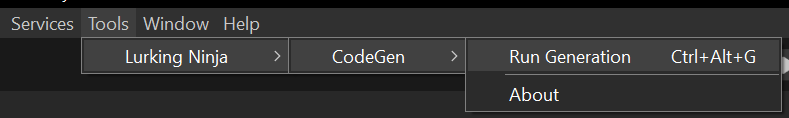
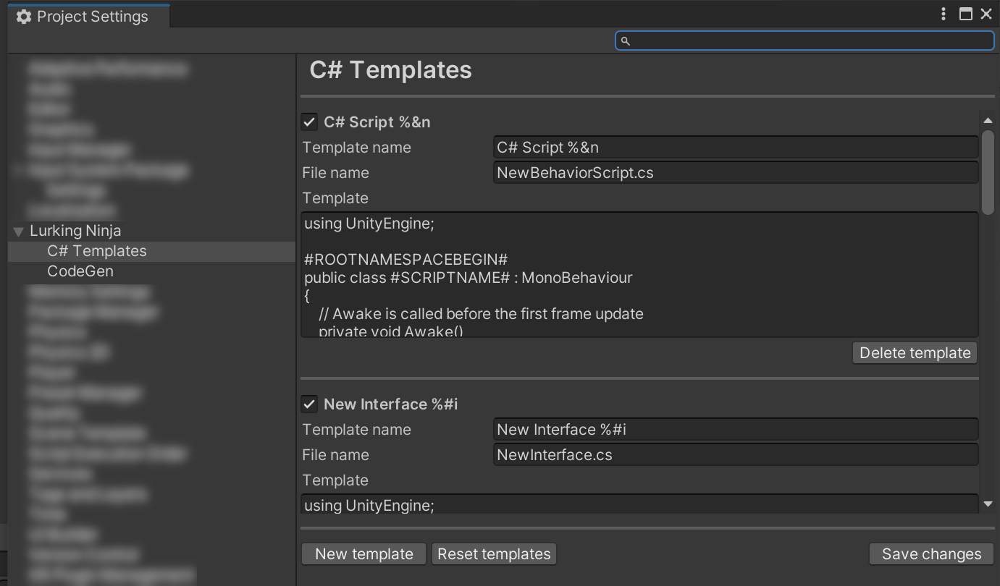

# Lurking Ninja's CodeGen Package
This is a package to automatically or manually generate C# accessor classes to reach various Unity data like
[Localization](https://docs.unity3d.com/Manual/com.unity.localization.html).

## Todo
Next I am planning to add support for scenes in
[build settings](https://docs.unity3d.com/Manual/BuildSettings.html) or in
[Build Profiles](https://docs.unity3d.com/6000.0/Documentation/Manual/build-profiles-reference.html)  and elements having IDs in
[UiDocuments](https://docs.unity3d.com/ScriptReference/UIElements.UIDocument.html) (some restriction probably will apply).

## Installation
If you any of the packages or services above is not present in your project/editor, the corresponding CodeGen service will be disabled.

### Prerequisite
This package is using Unity's [EditorCoroutines](https://docs.unity3d.com/Manual/com.unity.editorcoroutines.html) package.
If it is not installed this package will attempt to install it.

You can choose manually install this package or install from GitHub source.

### Add package from git URL
Use the Package Manager's ```+/Add package from git URL``` function.
The URL you should use is this:
```
https://github.com/LurkingNinja/com.lurking-ninja.input-codegen.git?path=Packages/com.lurking-ninja.input-codegen
```

### Manual install
1. Download the latest ```.zip``` package from the [Release](https://github.com/LurkingNinja/com.lurking-ninja.input-codegen/releases) section.
2. Unpack the ```.zip``` file into your project's ```Packages``` folder.
3. Open your project and check if it is imported properly.

## Usage
This tool is generating C# classes automatically whenever possible. When it is not, you can always run the generator from the menu:

You can open up the [Project Settings](https://docs.unity3d.com/Manual/comp-ManagerGroup.html) and set some data to help generate C# classes.

This will change over time when I add support for other services.

### Generic settings
#### Run CodeGen automatically
If this checked, the generator will automatically run when data gets changed in supported services.
Please read through the usage of the individual service support usage when automatic generation isn't possible because of lack of support from Unity.
#### Namespace
If you want to enforce a specific namespace for the generated C# code you can add here.
#### Path to generate
This should be a folder (if it doesn't exists it will be created) to place all the C# code generated for this specific service.
#### Various templates
These depend on the specific service and used to generate the C# code including class and individual elements.

### Input System
CodeGen used to support the Input System, over time Unity improved their codegen for this package so that support is discontinued.
### Localization
The Localization service help Unity's [Localization package](https://docs.unity3d.com/Manual/com.unity.localization.html)'s entries.
After creating [String Table](https://docs.unity3d.com/Packages/com.unity.localization@1.5/manual/StringTables.html)s all entries become accessible from C#.
Example:
```csharp
//------------------------------------------------------------------------------
// <auto-generated>
//     This code was generated by a tool.
//     Generated: 10/25/2024 10:31:27 PM
//
//     Changes to this file may cause incorrect behavior and will be lost if
//     the code is regenerated.
// </auto-generated>
//------------------------------------------------------------------------------

using System.Collections.Generic;
using UnityEngine.Localization.Settings;

public static partial class I18N
{
    public static class @Test
    {
        private const string @NAME = "Test"; 
			public static string @New_Entry1 => LocalizationSettings.StringDatabase.GetLocalizedString(NAME, 11827220480);
			public static string @xfvxvx => LocalizationSettings.StringDatabase.GetLocalizedString(NAME, 4700304117760);

    }
}
```
You can access the entries through ```I18N.<Stringtable Name>.<Entry>```, this returns with the string translated to the active, selected language.